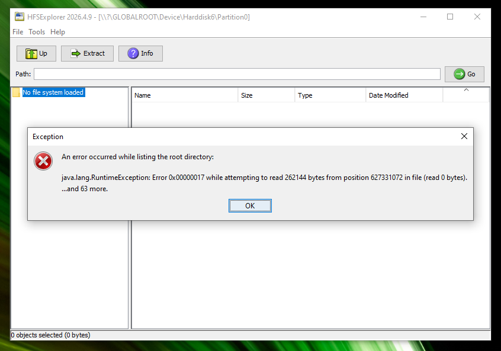
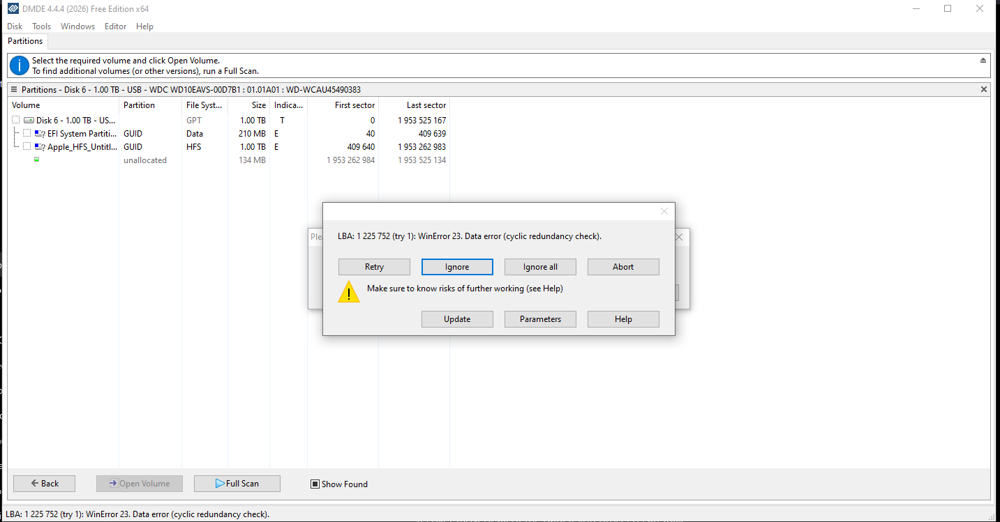
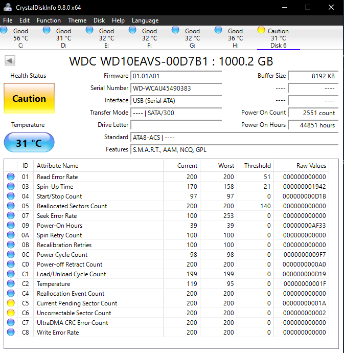
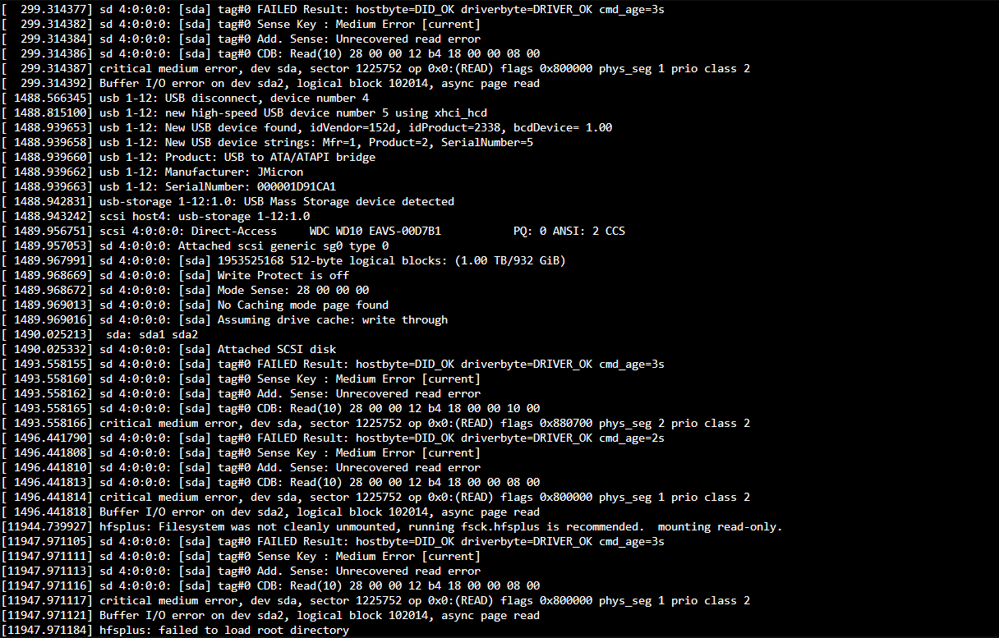
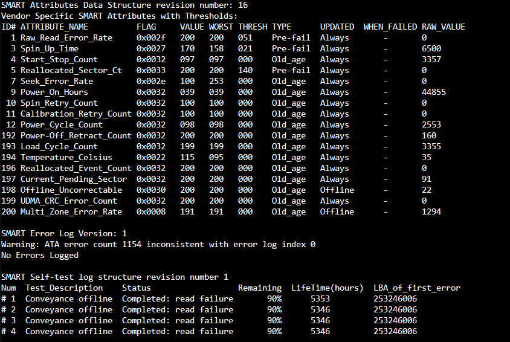
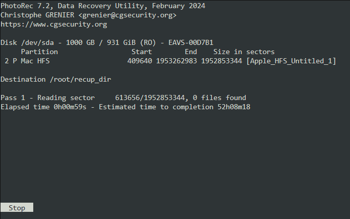

# Findings

## Initial Symptoms

- iMac powered on successfully.
- Startup chime was present.
- Display remained on a blank white screen.
- Operating system did not boot.

## Drive Identification

Drive Model:
- Western Digital WD10EAVS

Filesystem:
- Apple HFS+

Capacity:
- 1TB

## Windows Analysis

### HFSExplorer

Observed behavior:
- Filesystem could not be loaded.
- Reported zero-byte results.

### DMDE

Observed behavior:
- GPT partition table detected.
- HFS+ partitions identified.
- Metadata visible.
- User files inaccessible.

### CrystalDiskInfo

Initial SMART review indicated pending and uncorrectable sectors.

## Linux Analysis

### fdisk

Successfully detected:
- EFI partition
- HFS+ partition (~931 GB)

### Mount attempt

Mounting failed due to filesystem errors.

Error:
"Can't read superblock"

### Kernel Logs

dmesg reported:
- Unrecovered read errors
- Critical medium errors
- Buffer I/O errors
- Failed root directory loading

### SMART Analysis

Notable attributes:
- Current Pending Sectors: 91
- Offline Uncorrectable Sectors: 22

Conclusion:
Filesystem metadata was likely damaged while significant user data remained readable.

### Recovery Outcome

PhotoRec successfully recovered:

- JPEG images
- PNG images
- GIF images
- Videos
- Miscellaneous user files (.doc, .docx, .xls, .xlsx, .pdf, etc)

Recovered EXIF metadata confirmed the presence of family photos taken on Apple devices.

Conclusion:
Filesystem structures were corrupted, but raw file data remained largely recoverable.
